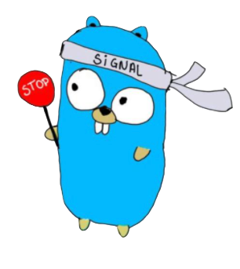

# Shutall



[](https://github.com/leozz37/shutall/actions/workflows/go.yaml)
[](https://goreportcard.com/report/github.com/leozz37/shutall)
[](https://pkg.go.dev/github.com/leozz37/shutall?tab=doc)

[](https://opensource.org/licenses/MIT)

Shutall is a simple graceful shutdown package that makes your code short, that deals with interruptions from OS and works with all the major web frameworks.

## Contents

- [Installation](#installation)
- [Quickstart](#quickstart)
- [Documentation](#documentation)
- [Examples](#examples)
- [Testing](#testing)
- [License](#license)

## Installation

Run the following:

```shell
$ go get -u "github.com/leozz37/shutall"
```

Import it in your code:

```go
import "github.com/leozz37/shutall"
```

## Quickstart

Shutall has only one function: `Run(server *http.Server, timeout time.Duration)`. You send a `http.Server` and a `time.Durantion` to it and it does all the work:

The `server` parameter is a `http.Server`, compatible with all web frameworks, `timeout` is how long the application will wait for the requests to finish before closing the application.

```Go
package main

import "github.com/leozz37/shutall"

func main() {
    handler := http.NewServerMux()
	handler.HandleFunc("/", func(rw http.ResponseWriter, r *http.Request) {
		fmt.Fprintf(rw, "Hello world")
	})

    svr := &http.Server{
		Addr:    ":8080",
		Handler: handler,
	}
	Run(svr, 2*time.Second)
}
```

## Documentation

The library consists only of the `Run()` function. You can check the full documentation on [Godoc](https://pkg.go.dev/github.com/leozz37/shutall#section-documentation).

### Run

Executes the `http.Server` and starts to Listen to requests. **It's a blocking command**. You can make it non blocking with channels, like this:

```go
go shutall.Run(server, timeout)
```

The function signature is `Run(server *http.Server, timeout time.Duration)`. The parameters are:

- `server`: your API handler. If you use a web framework, check the [examples](#examples) sections to see how to create a `http.Server` var.
- `timeout`: the time that your application will wait till all the requests are finished, and after this time, it will close the application. It's given in `time.Duration`, so if you need 5 seconds for example, you can use `5 * time.Second`.

## Examples

For the major web frameworks out there, here's some examples:

### Gin

```go
package main

import (
    "github.com/gin-gonic/gin"
    "github.com/leozz37/shutall"
)

func main() {
	r := gin.Default()
	r.GET("/ping", func(c *gin.Context) {
		c.JSON(200, gin.H{
			"message": "pong",
		})
	})

	svr := &http.Server{
		Addr:    "8080",
		Handler: r,
	}
	Run(svr, 2*time.Second)
}
```

### Echo

```go
package main

import (
    "github.com/labstack/echo"
    "github.com/leozz37/shutall"
)

func main() {
	e := echo.New()
	e.GET("/", func(c echo.Context) error {
		return c.String(http.StatusOK, "Hello, World!")
	})

	svr := &http.Server{
		Addr:    "8080",
		Handler: e,
	}
	Run(svr, 2*time.Second)
}

```

### Fiber


```go
package main

import "github.com/gofiber/fiber/v2"

func main() {
    app := fiber.New()

    app.Get("/", func(c *fiber.Ctx) error {
        return c.SendString("Hello, World 👋!")
    })

    svr := &http.Server{
		Addr:    "8080",
		Handler: app,
	}
	Run(svr, 2*time.Second)
}
```

## Testing

To run tests suite, run the following:

```shell
$ make test
```

To run the tests with coverage, run the following:

```shell
$ make test-coverage
```

## License

Hare is released under the [MIT License](./LICENSE).
